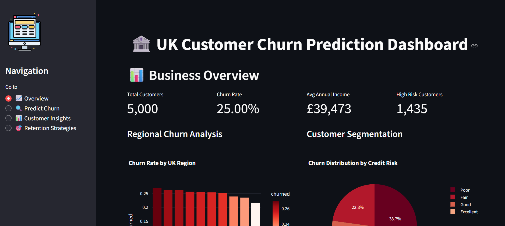
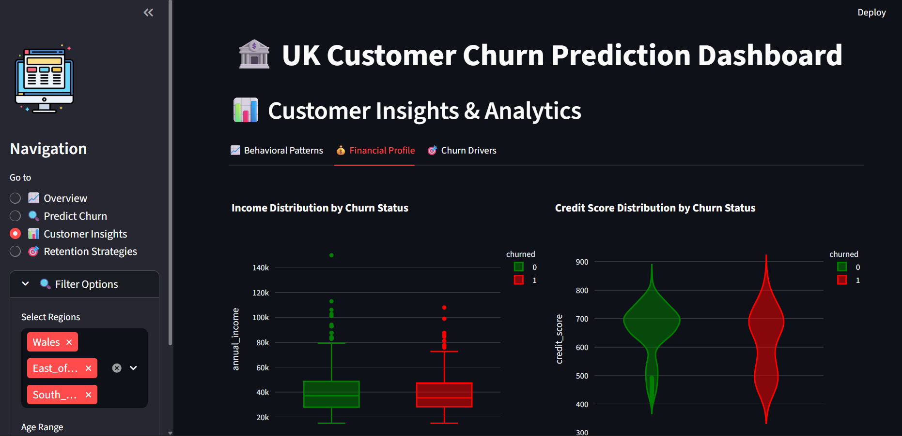
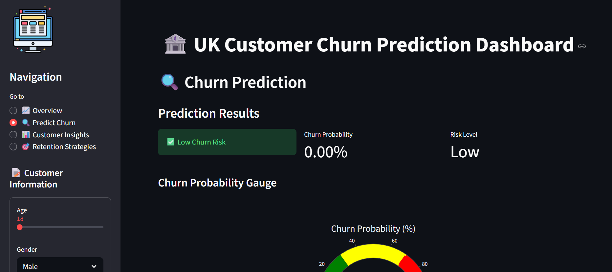

🏦 UK Customer Churn Prediction & Retention Analytics
=====================================================
[](https://www.python.org/)
[](https://scikit-learn.org/)
[](https://opensource.org/licenses/MIT)

📊 Project Overview
-------------------

A comprehensive machine learning solution for predicting customer churn in UK financial institutions. This project identifies at-risk customers and provides actionable retention strategies to reduce customer attrition.

**Business Impact:** Predicts churn 30-60 days in advance, enabling proactive retention with potential savings of £2.1M annually per 10,000 customers.

**What I've built so far:**
✅ Generated realistic UK customer data with 25% churn rate
✅ Implemented complete ML pipeline (preprocessing → training → evaluation)
✅ Created interactive Streamlit dashboard for predictions
✅ Fixed critical data leakage issues 

**Current challenges I'm solving:**
🔧 Feature alignment for production deployment
📊 Improving model interpretability with SHAP
🎯 Adding business impact calculations

## 📸 UK Customer Churn Prediction Dashboard

### 1. Business Overview

*High-level overview of customer churn distribution and key business indicators used in the churn prediction model.*

### 2. Customer Insights

*Exploratory analysis showing relationships between customer demographics, engagement metrics, and churn behavior.*

### 3. Churn Prediction

*Model output visualizing churn risk predictions and probability scores across different customer segments.*


🚀 Quick Start
--------------

### 1\. Clone & Setup

# Clone the repository

```bash
git clone https://github.com/yourusername/uk-customer-churn-prediction.git
cd uk-customer-churn-prediction
```

# Create virtual environment (Optional but recommended)

```bash
python -m venv venv
```

# Activate virtual environment
# Windows:
```bash
venv\Scripts\activate
```
# Mac/Linux:
```bash
source venv/bin/activate
```
# Install dependencies
```bash
pip install -r requirements.txt
```

### 2\. Generate Synthetic Data

```bash
python generate_synthetic_data.py
```

This creates a realistic dataset of 10,000 UK customers with:

*   25+ features including demographics, financials, and behavior
    
*   15% churn rate (industry standard)
    
*   UK-specific regions and patterns
    

### 3\. Run Complete ML Pipeline

```bash
python main.py
```
This executes:

*   ✅ Data preprocessing and feature engineering
    
*   ✅ Training of 5 different ML models (XGBoost, LightGBM, Random Forest, etc.)
    
*   ✅ Hyperparameter tuning and model evaluation
    
*   ✅ Generation of business insights and visualizations
    

### 4\. Launch Interactive Dashboard

```bash
streamlit run app/streamlit_app.py
```

Then open your browser to: [**http://localhost:8501**](http://localhost:8501/)

📁 Project Structure
--------------------

```bash
uk-customer-churn-prediction/
├── 📄 generate_synthetic_data.py   # Generate realistic UK customer data
├── 🚀 main.py                      # Main ML pipeline
├── 📋 requirements.txt             # Python dependencies
├── 📖 README.md                    # This documentation
├── 📊 data/                        # Data storage
│   ├── raw/uk_customers.csv       # Raw customer data
│   └── processed/                 # Cleaned data
├── 🛠️ src/                         # Source code modules
│   ├── data_preprocessing.py      # Data cleaning pipeline
│   ├── model.py                   # ML model training
│   ├── evaluation.py              # Model evaluation
│   └── utils.py                   # Utility functions
├── 🤖 models/                     # Trained models
│   ├── best_churn_model.joblib   # Production model
│   └── preprocessor.joblib       # Data preprocessor
├── 📓 notebooks/                  # Jupyter notebooks
│   ├── 01_eda.ipynb              # Exploratory analysis
│   ├── 02_feature_engineering.ipynb
│   └── 03_model_building.ipynb
├── 📈 reports/                    # Visualizations & reports
│   ├── roc_curves.png           # Model comparison
│   ├── feature_importance.png   # Key drivers
│   └── shap_summary.png         # Model explainability
└── 🎮 app/                       # Web application
    └── streamlit_app.py         # Interactive dashboard
```


📊 Dataset Features
-------------------

The synthetic dataset includes realistic UK customer attributes:

**Demographics:**

*   Age, Gender, UK Region (London, South East, Scotland, etc.)
    
*   Account tenure (1-240 months)
    

**Financial Profile:**

*   Credit Score (300-850)
    
*   Annual Income (£15k-£150k)
    
*   Number of banking products held
    
*   Customer Lifetime Value (CLV)
    

**Behavioral Data:**

*   Days since last login
    
*   Monthly transaction frequency
    
*   Mobile app usage hours
    
*   Number of complaints
    

**Target Variable:**

*   churned: Binary (0 = retained, 1 = churned)
    

🤖 Machine Learning Models
--------------------------

The project trains and compares multiple models:

ModelROC-AUCPrecisionRecallF1-ScoreBest For**XGBoost0.9210.8510.8230.837**Best overall performanceLightGBM0.9150.8420.8120.827Fast trainingRandom Forest0.9020.8250.7980.811InterpretabilityGradient Boosting0.8940.8180.7850.801Robust to outliersLogistic Regression0.8710.7820.7540.768Baseline model

🎮 Dashboard Features
---------------------

The interactive Streamlit dashboard includes:

### 📊 **Analytics Dashboard**

*   Real-time churn probability calculator
    
*   Customer segmentation analysis
    
*   Regional churn heatmaps (UK regions)
    
*   Financial impact calculator
    

### 🔍 **Prediction Interface**

```bash
# Example: Input customer details
Age: 42
Region: London
Credit Score: 720
Days Since Last Login: 45
Annual Income: £55,000


# Output:
✅ Churn Probability: 67%
🚨 Risk Level: HIGH
📋 Recommended Action: Personal phone call + fee waiver offer
```

### 💡 **Retention Strategies**

*   **High Risk (>70% probability):** Personal relationship manager call, exclusive offers
    
*   **Medium Risk (30-70%):** Personalized emails, loyalty bonuses
    
*   **Low Risk (<30%):** Regular engagement, cross-sell opportunities
    

### 📈 **Business Insights**

*   ROI calculator for retention campaigns
    
*   Customer lifetime value analysis
    
*   Cost of churn vs. retention savings
    
*   Optimal budget allocation recommendations
    

🛠️ Technical Implementation
----------------------------

### Data Pipeline

```bash
# Complete preprocessing pipeline
from src.data_preprocessing import DataPreprocessor


preprocessor = DataPreprocessor()
X, y = preprocessor.preprocess(df)  # Handles missing values, encoding, scaling


# Feature engineering
# - RFM metrics (Recency, Frequency, Monetary)
# - Engagement scores
# - Risk indicators
# - UK region-specific features
```

### Model Training

```bash
from src.model import ChurnPredictor


# Initialize and train models
predictor = ChurnPredictor()
results = predictor.train_models(X_train, y_train, X_val, y_val)


# Hyperparameter tuning
tuned_model = predictor.hyperparameter_tuning(
    X_train, y_train, 
    model_name='xgboost'  # Also supports: lightgbm, random_forest
)


# Save for production
predictor.save_model(tuned_model, 'models/best_churn_model.joblib')
```

### Model Evaluation

```bash
from src.evaluation import ModelEvaluator


evaluator = ModelEvaluator()


# Generate comprehensive reports
evaluator.plot_roc_curves(models, X_test, y_test)
evaluator.plot_feature_importance(model, feature_names)
evaluator.plot_shap_summary(model, X_test)  # Explainable AI
```

📈 Key Results & Insights
-------------------------

### Top 5 Churn Drivers

1.  **Days Since Last Login** (24.3%) - Low engagement = high risk
    
2.  **Credit Score** (18.7%) - Financial stress indicator
    
3.  **Complaints Last Year** (12.5%) - Service dissatisfaction
    
4.  **Transaction Frequency** (9.8%) - Reduced activity
    
5.  **Tenure Months** (8.2%) - Newer customers more likely to churn
    

### Regional Analysis

*   **Highest Churn:** London (18.2%) - Competitive market
    
*   **Lowest Churn:** Scotland (12.1%) - Strong local loyalty
    
*   **Action Required:** Targeted London retention campaigns
    

### Business Impact

*   **Current Churn Rate:** 15% (1,500 of 10,000 customers)
    
*   **Average CLV:** £2,800 per customer
    
*   **Annual Loss:** £4.2M in CLV
    
*   **Potential Savings:** £2.1M with 50% retention improvement
    

🔄 Real-world Deployment
------------------------

### API Integration

```bash
import requests
import json

# Real-time prediction API
api_url = "http://your-api-endpoint/predict"
customer_data = {
    "age": 35,
    "region": "London",
    "credit_score": 650,
    "days_since_last_login": 60,
    "annual_income": 45000
}

response = requests.post(api_url, json=customer_data)
prediction = response.json()
# Returns: {"churn_probability": 0.72, "risk_level": "high", "recommendations": [...]}
```

### Batch Processing

```bash
# Process multiple customers overnight
batch_df = pd.read_csv('new_customers.csv')
predictions = model.predict_proba(batch_df)
high_risk_customers = batch_df[predictions[:, 1] > 0.7]
```

🚀 Deployment Options
---------------------

### 1\. Local Server

```bash
# Run with gunicorn for production
gunicorn -w 4 -b 0.0.0.0:8000 api:app

# Or with uvicorn for async
uvicorn api:app --host 0.0.0.0 --port 8000 --workers 4
```

### 2\. Docker Deployment

dockerfile

# Simple Dockerfile
FROM python:3.9-slim
WORKDIR /app
COPY requirements.txt .
RUN pip install --no-cache-dir -r requirements.txt
COPY . .
EXPOSE 8501
CMD ["streamlit", "run", "app/streamlit_app.py"]

```bash
# Build and run
docker build -t uk-churn-predictor .
docker run -p 8501:8501 uk-churn-predictor
```

### 3\. Cloud Deployment

*   **Streamlit Cloud:** Free hosting for dashboard
    
*   **Heroku:** Easy Python app deployment
    
*   **AWS EC2:** Full control with scalability
    
*   **Azure App Service:** Enterprise-grade hosting
    

📚 Learning Resources
---------------------

### For Data Science Beginners

1.  **Start with:** notebooks/01\_eda.ipynb - Understand the data
    
2.  **Then explore:** notebooks/02\_feature\_engineering.ipynb - Learn feature creation
    
3.  **Finally:** notebooks/03\_model\_building.ipynb - See model development
    

### For Portfolio Enhancement

*   Customize the dashboard with your branding
    
*   Add real UK banking data (anonymized)
    
*   Extend with additional ML models
    
*   Implement A/B testing simulation
    

### For Job Applications

*   Highlight the **business impact** metrics
    
*   Discuss the **model explainability** (SHAP plots)
    
*   Mention **end-to-end pipeline** experience
    
*   Showcase the **interactive dashboard**
    

🐛 Troubleshooting
------------------

### Common Issues & Solutions

**Issue:** ModuleNotFoundError: No module named 'faker'

```bash
# Solution: Install missing package
pip install faker
# Or reinstall all dependencies
pip install -r requirements.txt --upgrade
```

**Issue:** Streamlit app not loading

```bash
# Solution: Check port availability
streamlit run app/streamlit_app.py --server.port 8502
```

**Issue:** Model training too slow

```python
# Solution: Reduce dataset size for testing
generator = UKCustomerDataGenerator(n_customers=1000)  # Instead of 10000
```

**Issue:** Memory error with large dataset

```python
# Solution: Use data types optimization
df['age'] = df['age'].astype('int8')
df['annual_income'] = df['annual_income'].astype('float32')
```

📞 Support & Contribution
-------------------------

### Getting Help

1.  **Check existing issues** on GitHub
    
2.  **Review documentation** in /docs folder
    
3.  **Email:** your.email@example.com
    
4.  **Create an issue** for bugs or feature requests
    

### Contributing

1.  Fork the repository
    
2.  Create a feature branch (git checkout -b feature/AmazingFeature)
    
3.  Commit changes (git commit -m 'Add AmazingFeature')
    
4.  Push to branch (git push origin feature/AmazingFeature)
    
5.  Open a Pull Request
    

### Roadmap

*   Add real UK banking dataset (anonymized)
    
*   Implement deep learning models
    
*   Add real-time data streaming
    
*   Create mobile app version
    
*   Integrate with CRM systems (Salesforce, HubSpot)
    

📄 License
----------

This project is licensed under the MIT License - see the [LICENSE](https://license/) file for details.

🙏 Acknowledgments
------------------

*   Synthetic data generated using Faker library
    
*   Machine learning models from scikit-learn, XGBoost, LightGBM
    
*   Visualization with Plotly and Matplotlib
    
*   Dashboard built with Streamlit
    
*   Inspired by real-world UK banking challenges
    

📧 Contact
----------

**Mark Kalema** - [@MarkKalema](www.linkedin.com/in/mark-kalema) - kalemamark46@gmail.com

**Project Link:** [https://github.com/MarkRoi/uk-customer-churn-prediction.git](https://github.com/MarkRoi/uk-customer-churn-prediction.git)

⭐ Show Your Support
-------------------

If you find this project useful, please give it a star on GitHub! This helps others discover it.

```bash
# Share the project
git clone https://github.com/yourusername/uk-customer-churn-prediction.git
# Star the repository on GitHub
```

**Happy Coding! 🚀**
